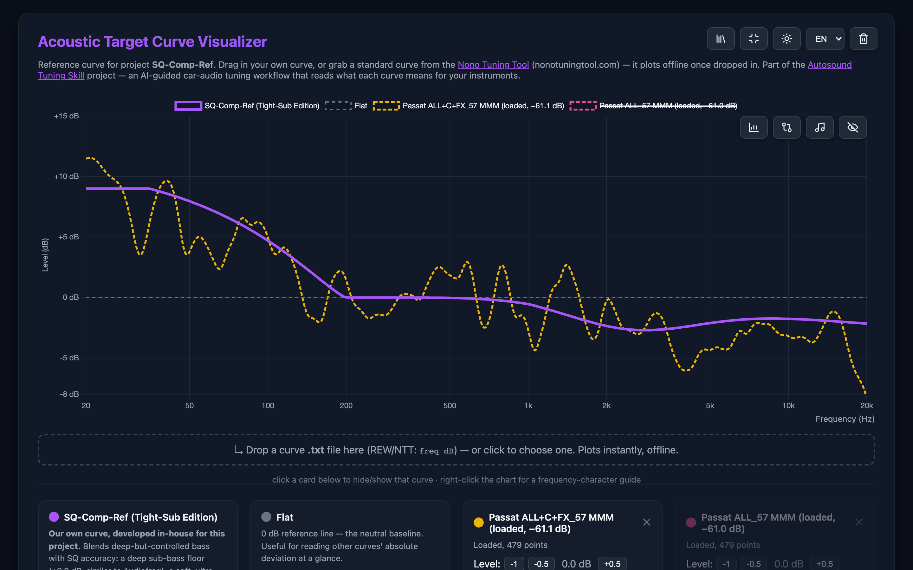
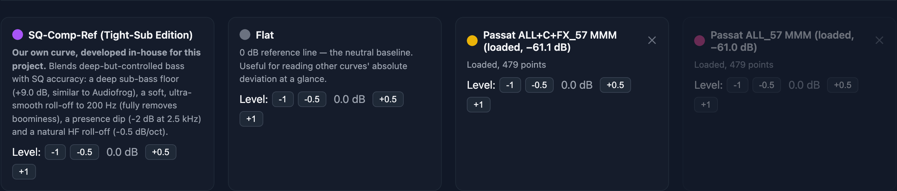
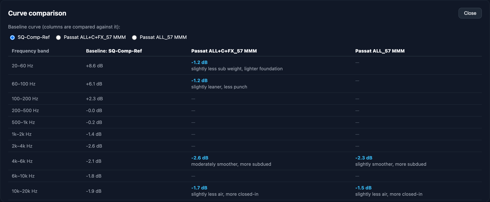
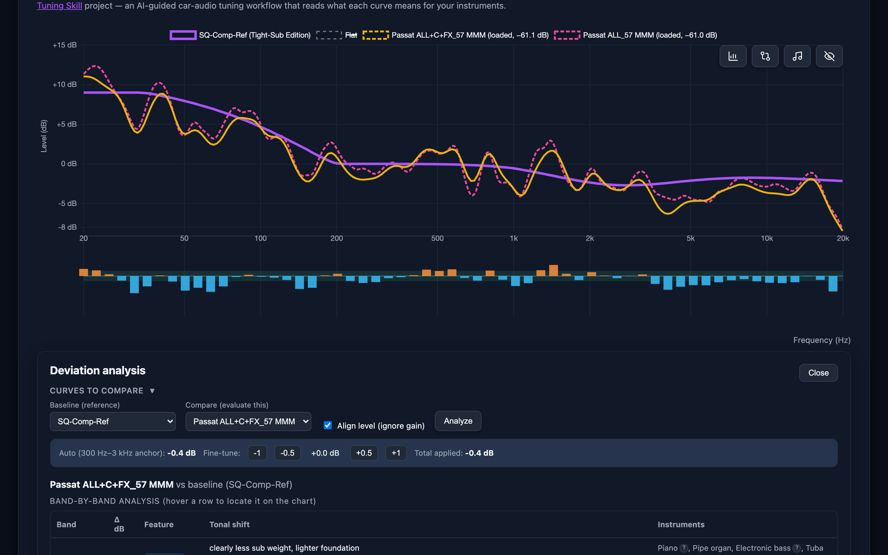
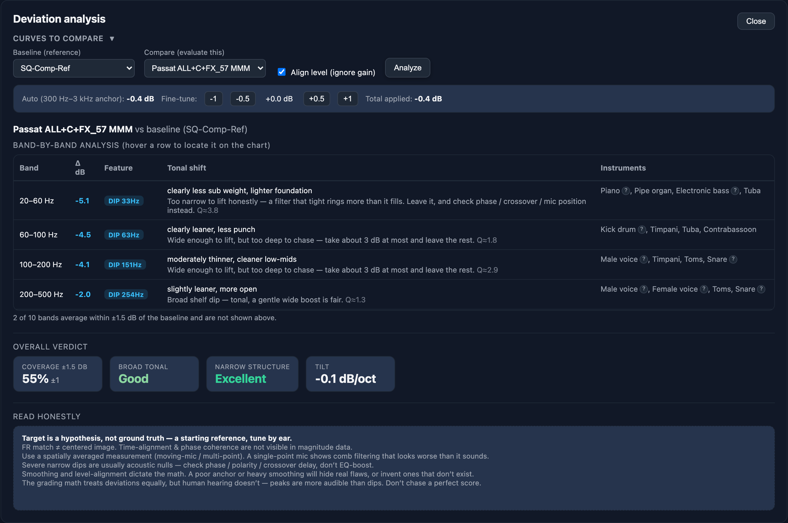
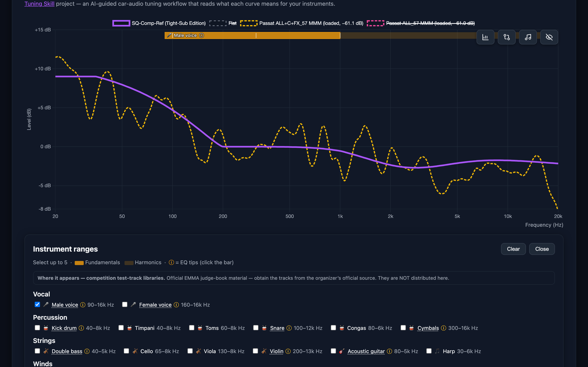
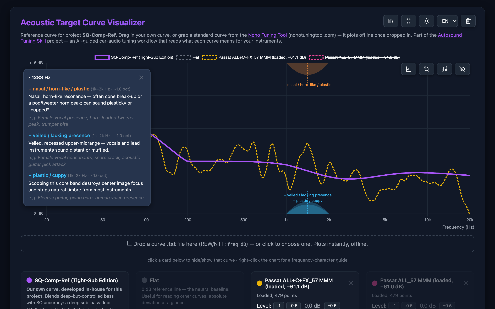
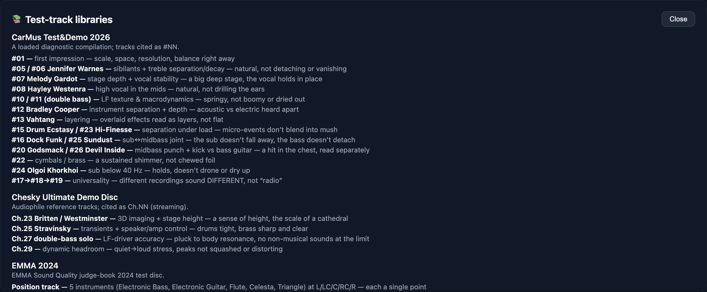

# The house curve in TCC

**In one line:** where TCC shows your target (house) curve, how it opens the method's target-curve
tool, and what each button in that tool does.

A target (house) curve is the tonal shape a tune aims for. What it is, how to choose and build one
is in the method's
[target-curve guide](https://github.com/ayukhno/autosound-tuning-skill/blob/main/skills/autosound-tuning/references/patterns/target-curves/target_curves_guide.md),
and how to finish it by ear is in
[voicing by ear](https://github.com/ayukhno/autosound-tuning-skill/blob/main/skills/autosound-tuning/references/patterns/voicing-by-ear.md).
This page covers only the buttons.

The screenshots show a real car: two MMM measurements of a VW Passat B8 read against the bundled
SQ-Comp-Ref curve.

## Where TCC shows it

The header shows the target curve of the preset you are looking at, under **Target curve**. It is
the name the project has recorded; TCC does not choose it.

## Opening it in the target-curve tool

Click that name, or pick *Target-curve tool* under *Tools* in the *☰ Menu*. The tool opens in your
browser. It carries only the method's own curves, so for any other curve TCC finds the curve's file
in the project folder and does one of these, and the status line says which:

- **Hands it over in the link.** The page opens with your curve already on the plot.
- **Opens a local copy of the tool** with your curve plotted, built from the method version this
  TCC is pinned to.
- **Selects the file in your file manager.** Drag it onto the page.
- **Finds no file.** The page opens with its own curves, and the status line names the folder to
  export the curve into. Where a project keeps its curves is in the method's
  [target-curves README](https://github.com/ayukhno/autosound-tuning-skill/blob/main/skills/autosound-tuning/references/patterns/target-curves/README.md).

Without TCC, open `curves.html` in your project folder, or the
[published page](https://ayukhno.github.io/autosound-tuning-skill/skills/autosound-tuning/references/patterns/target-curves/target_curves_visualizer.html).
The page works offline, and nothing you load leaves your computer.

## The page

The chart shows every visible curve on one frequency axis. The buttons at the top right are the
**test-track libraries**, **wide / narrow layout**, **light / dark theme**, the **language** (EN, UA,
DE, PL) and, once you have loaded something, **🗑 Clear loaded curves**. The bundled curves stay.

The four buttons on the chart are **Analyze**, **Compare**, **Musical instruments** and **Hide all /
Show all**.

## Loading a curve or a measurement

Drop a `.txt` file with `freq dB` pairs on the dashed box, or click the box to pick one. REW and the
Nono Tuning Tool both write this format. From REW, use *File → Export → Export measurement as text*.

When the file loads, the page suggests a level offset that puts the 200–500 Hz band near 0 dB, so a
measurement at 60 dB SPL lines up with a curve drawn around 0. Accept it, or type your own value.
The page remembers loaded curves in this browser.

Each curve has a card below the chart:

- **Click the card** to hide or show the curve.
- **The coloured dot** changes the curve's colour.
- **Level −1 −0.5 +0.5 +1** shifts the curve up or down.
- **×** removes a loaded curve.

## Compare

**Compare** puts every visible curve into one table, band by band, against the **Baseline** you
pick at the top. Each cell is the band's **average** difference from the baseline, with a few words
on how it sounds. A dash means less than 1 dB. Hide curves you don't want in
the table before you press the button, since it takes everything visible.

## Analyze: a measurement against the target

1. Press **Analyze** on the chart.
2. Under *Curves to compare*, choose the **Baseline** (your target) and **Compare** (the
   measurement).
3. Leave **Align level (ignore gain)** on. The page matches the two levels over 300 Hz–3 kHz and
   shows how much it moved them. **Fine-tune** adjusts that by hand.
4. Press **Analyze** in the panel. Press it again after you change anything above.

The bars under the chart show the deviation along the whole range: orange where the measurement is
above the target, blue where it is below.

**Band-by-band analysis** lists what stands out, one peak, dip or null per row. There can be two
rows in one band.

- **Δ dB** is the height or depth of that one feature. It is not the band average that *Compare* shows, so
  the two can differ for the same band.
- **Feature** says what it is (PEAK, DIP, NULL) and where.
- **Tonal shift** says how it sounds, and the line under it says what may be done about it, with the
  feature's approximate Q.
- **Instruments** names what lives there. **?** next to an instrument lists test tracks where you
  can hear it.

Hover a row to find it on the chart. Bands within ±1.5 dB of the target are counted but not listed.

**Overall verdict** grades the match: **Coverage ±1.5 dB**, **Broad tonal**, **Narrow structure**
and **Tilt**. Hover a grade to see how it is worked out. **Read honestly** lists the limits of
this kind of reading. How far the numbers can be trusted is in the method's
[deviation-analysis audit](https://github.com/ayukhno/autosound-tuning-skill/blob/main/skills/autosound-tuning/references/patterns/target-curves/deviation-analysis-audit.md).

## Instruments on the chart

**Musical instruments** opens a list grouped by family. Tick up to five, and each one appears above
the chart as a bar: the solid part is the fundamentals, the faint part the harmonics. An **ⓘ** has
EQ tips; click the bar to read them. **Clear** unticks them all.

## What a frequency sounds like

Right-click anywhere on the chart. A card opens for that frequency: what **too much** (+) and **too
little** (−) sound like there, with examples, and the matching region is shaded on the chart.

## Test-track libraries

The **📚** button lists competition test-track collections, and what each track is good for
checking. The tracks themselves are not included; get them from their official sources.
