# The TCC window, panel by panel

**In one line:** every part of the TCC window: what it shows, what each control does, and where
its data comes from. For a short tour, read [TCC in eight screens](QUICK-GUIDE.md) first.

The screenshots come from a real tuning project: a VW Passat B8 with a Helix DSP Ultra S, its notes
translated into English. The conversation in the dialog panel is an example.

## Contents

- [Words used here](#words-used-here)
- [The window](#the-window)
- [The header](#the-header)
- [The left column](#the-left-column)
  - [Project params](#project-params)
  - [System params](#system-params)
  - [Car audio analysis](#car-audio-analysis)
  - [DSP](#dsp)
- [The detail pane](#the-detail-pane)
  - [Tables](#tables)
  - [EQ](#eq)
  - [One parameter across every channel](#one-parameter-across-every-channel)
- [The AI dialog](#the-ai-dialog)
- [Plan — fact](#plan--fact)
- [In focus now: capture rounds](#in-focus-now-capture-rounds)
- [The curve window](#the-curve-window)
- [Control mode](#control-mode)
- [The menu](#the-menu)
- [Dialogs](#dialogs)
- [The footer](#the-footer)

## Words used here

| Word | Meaning |
|---|---|
| **Arbiter** | You. You decide; nothing is recorded without you. |
| **Generator** | The main AI (*AI main*): it reads the measurements and proposes the next step. |
| **Critic** | The reviewer (*AI critic*), a model from another vendor that checks the Generator's proposal. |
| **Configuration** | What is in the processor, recorded as a ledger version `v_NNN`. |
| **Preset** | The slot a configuration is fixed in, for example `SQ` for judging and `FULL` for daily driving. |
| **Series** | A set of measurements, numbered `_N` in the REW titles (`m-L_60 (sw)`). |
| **Capture round** | One pass of measurements that a step of the plan asks for. |
| **Phase** | A stage of the tuning plan, from −1 (intake) to 5 (variations). |

## The window

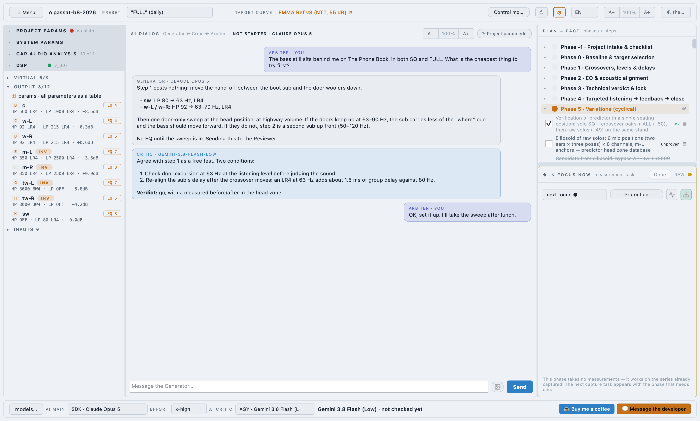

The header runs across the top and the footer across the bottom. Between them are three columns,
and you can drag the borders between them:

- **Left**: the project and the car, then the DSP tree.
- **Middle**: the AI dialog. A channel table or EQ opens above it.
- **Right**: the plan, and below it the capture card (*In focus now*).

The same window in the dark theme:

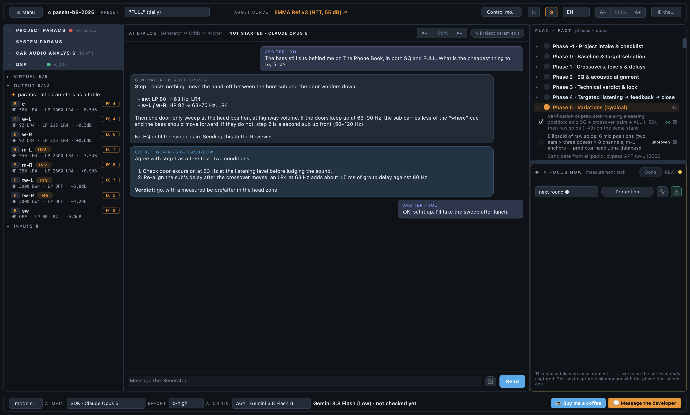

TCC reads the project folder and REW. It **never writes to your processor**: you enter the values in
your DSP software yourself, or import them there.

## The header

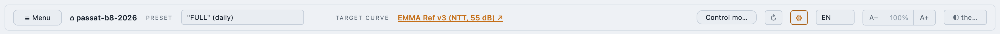

| Control | What it does |
|---|---|
| **☰ Menu** | Projects, sessions and models, appearance, tools, help. See [The menu](#the-menu). |
| **⌂ passat-b8-2026** | The project folder this window is bound to. |
| **Preset** | Which preset the tree and the tables show. |
| **Target curve** | The curve this project tunes to. Click it to open the [target-curve tool](HOUSE-CURVE.md) in a browser. |
| **Control mode** | Hands the session to a terminal. See [Control mode](#control-mode). |
| **⟳** | Reloads the project from disk: the DSP profile and the ledger. |
| **⚙** | Diagnostics: the project check, updates, installation and run logs. |
| **EN** | The interface language: English, Ukrainian, Polish or German. |
| **A− 100% A+** | The text size of the whole window. |
| **◐ theme** | Light or dark. |

## The left column

The column has four sections. Click a section's title to open or close it.

### Project params

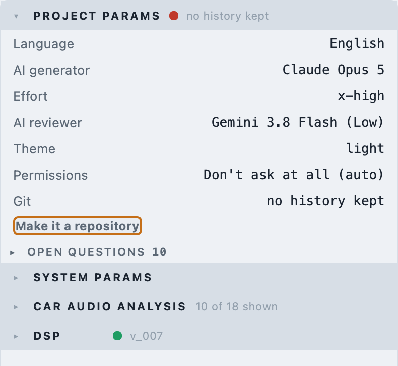

How this project is set up: the language of the conversation, the two models and how hard they
think (*Effort*), the theme, and the **Permissions** the AI works with. With *Don't ask at all
(auto)*, the AI runs its own tools without asking, but TCC still asks before anything that changes
the car.

**Git** says whether the project folder keeps a history. In the screenshot it does not, so the dot
is red and **Make it a repository** offers to start one. **Open questions** lists what the project
has not answered yet.

### System params

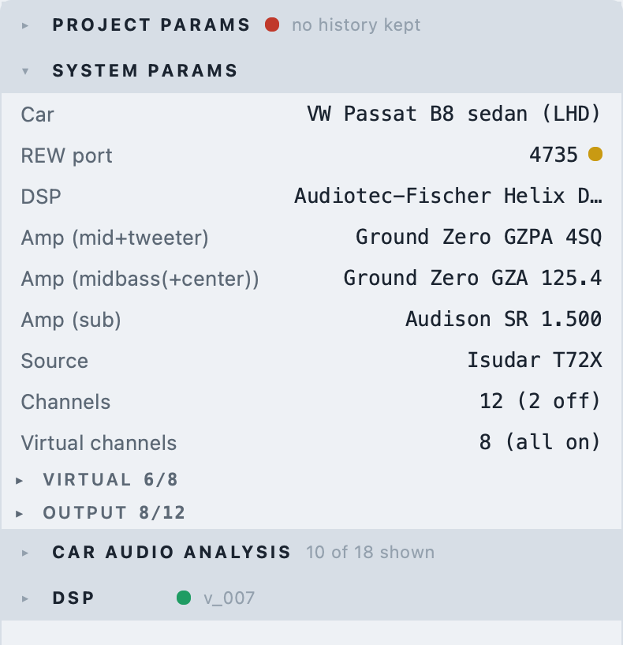

The rig: the car, the port REW's API listens on, the processor, the amplifiers, the source, and
how many channels are in use. The dot next to the port is yellow until REW has been checked, green
when REW answers, and red when it does not.

### Car audio analysis

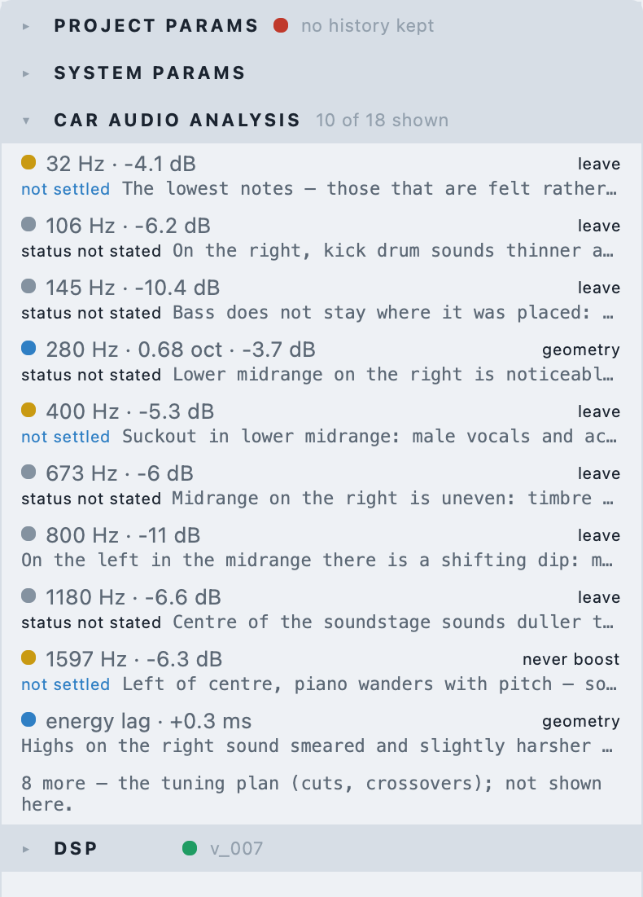

The flaw map: what this cabin does to the sound, measured in Phase 0. Each row is a frequency and a
depth, a line saying how it sounds, and what may be done about it:

- **leave**: leave it alone. EQ would not fix it.
- **geometry**: it comes from where the speakers are, so delay or placement is the tool, not EQ.
- **never boost**: a dip that must not be filled with gain.

The dot and the words under the frequency give the row's status (*not settled*, *status not
stated*). Rows that belong to the tuning plan (cuts, crossovers) are counted but hidden: *10 of 18
shown*.

### DSP

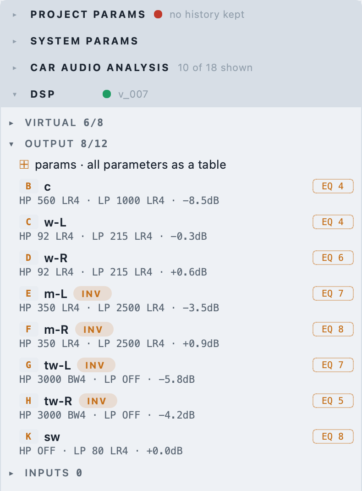

The processor as it is set now, and the configuration it holds (`v_007`). Channels are grouped by
tier: **Virtual**, **Output** and **Inputs**, each with a count of its channels. Each channel shows its
letter in the DSP software (`B`, `C`…), its name, the high- and low-pass filters, and the gain.
**INV** marks inverted polarity. **EQ n** says how many EQ bands are in use; click it to open them.

Click a channel for its row in the table, or *params · all parameters as a table* for the whole tier.

## The detail pane

The pane opens above the dialog when you click something in the DSP tree. Its tabs switch between
views: **Table**, **EQ**, **Gain**, **Delay**, **Phase**. **compare with** picks the configuration
to compare against. By default that is the one this configuration continues from, which is not
always the number just below it. **close ×** hides the pane.

### Tables

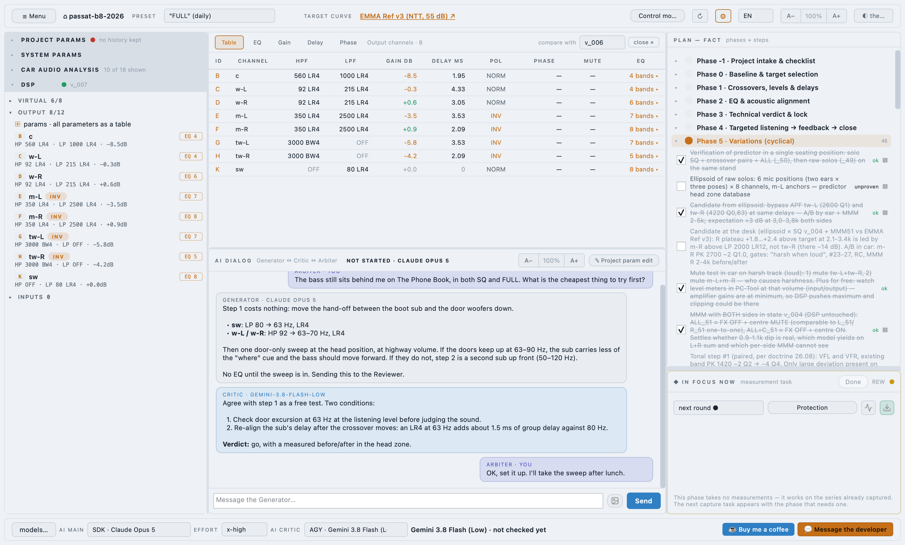

A tier as a table: the high- and low-pass filters with their slopes, gain, delay, polarity, phase,
mute, and the number of EQ bands. Hover over a value that differs from the compared configuration to
see what it was.

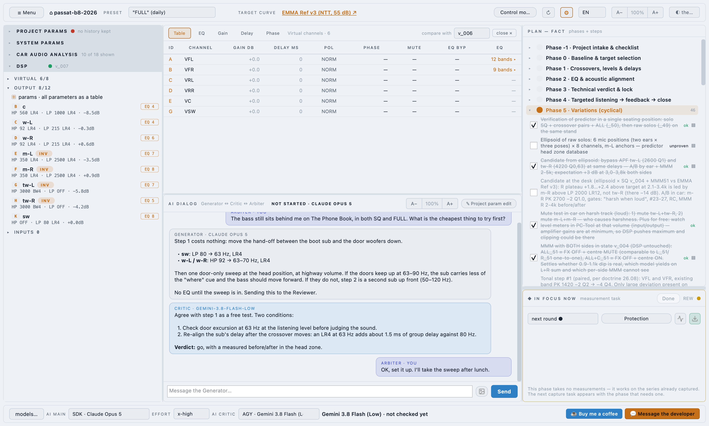

The virtual tier has the same layout.

### EQ

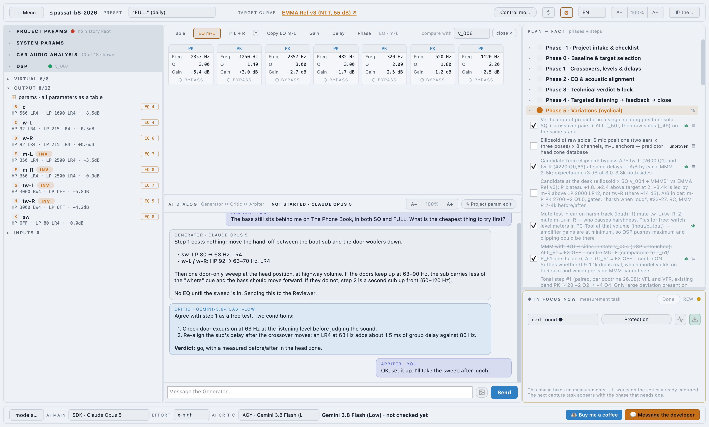

Only the bands in use, each with every parameter at once: type (PK, shelf, APF…), frequency, Q and
gain. An all-pass is a band type here, not a separate column. Bypass is shown, but it cannot be
changed from this window.

- **⇄ L + R** shows the left and the right channel of a pair together.
- **Copy EQ** puts the whole bank on the clipboard in your DSP software's format. The status line
  says which format was used and what that format could not carry.

The same view in the dark theme:

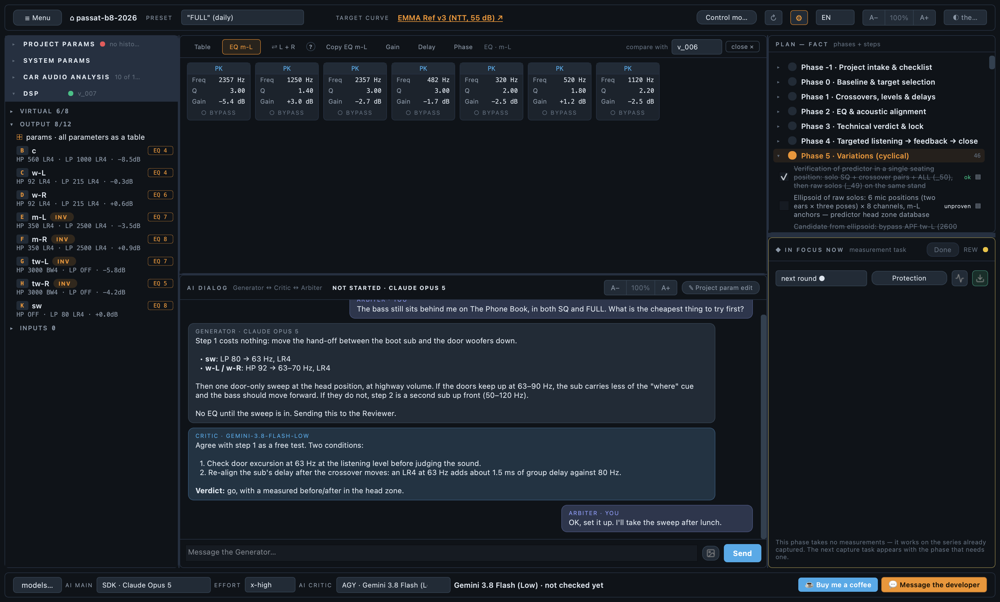

### One parameter across every channel

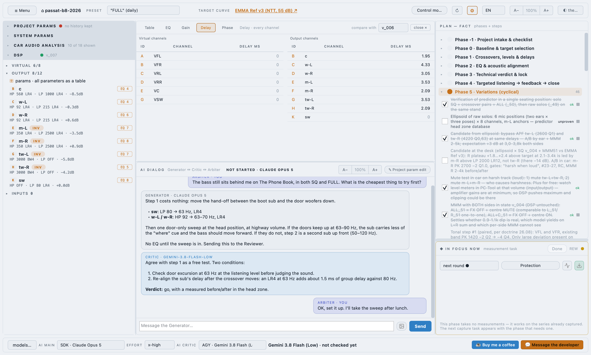

**Gain**, **Delay** and **Phase** put one parameter of every channel, in both tiers, into one table.
Use it to compare channels with each other.

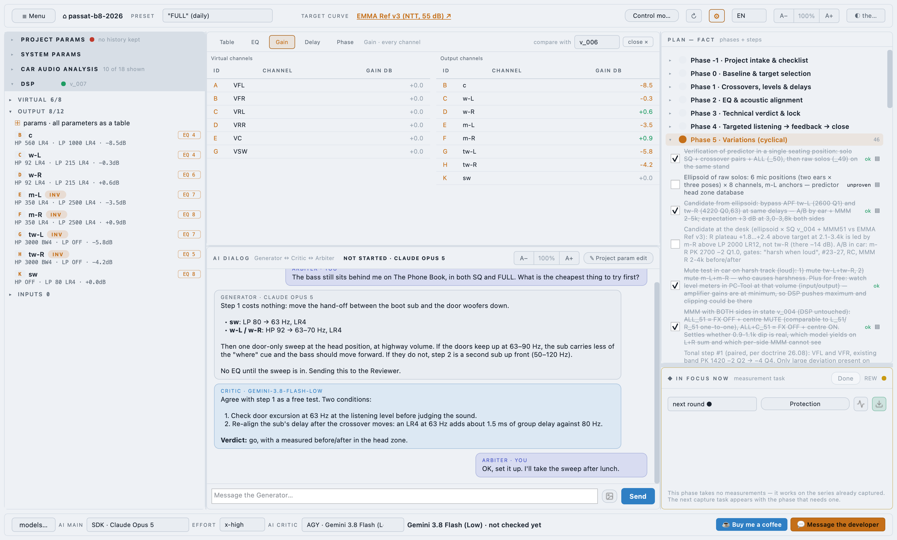

## The AI dialog

The dialog is in the middle of the [main window](#the-window). Each message is labelled with who
wrote it:

- **Arbiter · you**: your messages, on the right.
- **Generator · model**: the main AI's answers and proposals.
- **Critic · model**: the reviewer's check of a proposal, with its verdict.

Write in the box at the bottom, in any language, and press **Send**. The image button attaches a
screenshot. **A− 100% A+** in the dialog's own header changes the dialog's text size only.
**✎ Project param edit** is for a change the project's files do not show yet. It asks why: the
skill did not save it, or you changed something by hand.

Right-click almost anything in the window to copy its value, its row or its hint.

## Plan — fact

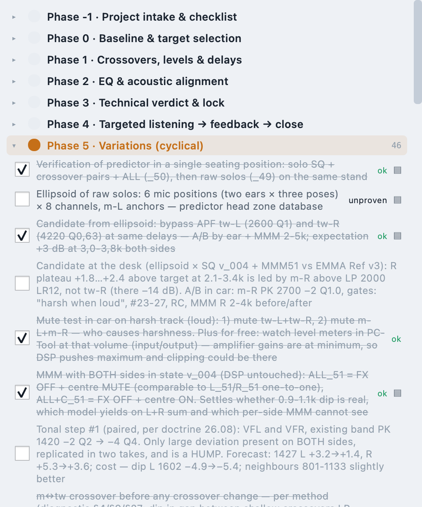

The plan the method keeps for this project: phases −1 to 5, and in each phase the steps it
contains. The current phase is orange, and its number on the right counts the steps.

- **A tick**, with the text struck through, means the step is closed.
- **ok**: closed, and the evidence it names (a file or a measurement) was found on disk.
- **unproven**: reported closed, but the evidence it names cannot be found. That is not the same as
  an unticked step, which was never finished.
- **wait**: still in progress, or closed and then invalidated by a change to the configuration, so
  it has to be taken again.

A step that used measurements has an icon that opens its capture round in the card below.

## In focus now: capture rounds

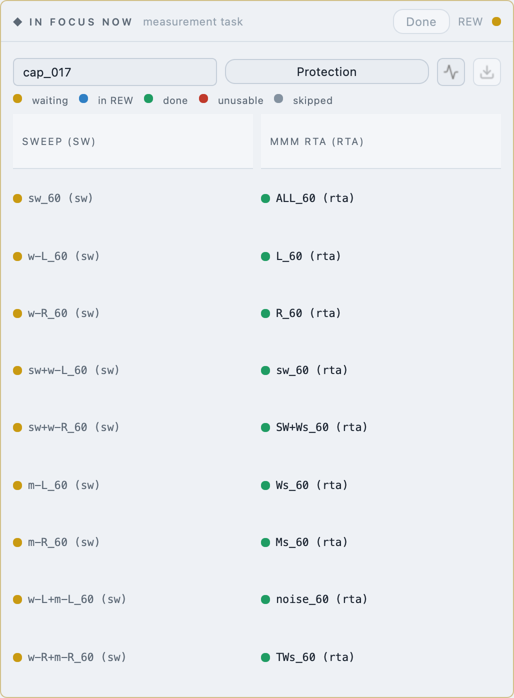

The card lists the measurements that the current step expects, by name, in one column per method:
**sweep (sw)** and **MMM RTA (rta)**. The dot in front of each name gives its state:

| Colour | State |
|---|---|
| yellow | **waiting**: not taken yet |
| blue | **in REW**: REW has it, not read yet |
| green | **done**: read and accepted |
| red | **unusable**: taken, failed the check, needs a retake |
| grey | **skipped** |

The controls, left to right:

- **The round picker** (`cap_017` here): the open round is first and marked **●**. Earlier rounds
  come after a separator.
- **Protection**: which protective filters a raw capture was taken through. See
  [Protective filters](#protective-filters).
- **∿**: opens the [curve window](#the-curve-window) on this round's measurements.
- **⬇**: reads the measurements from REW and matches them against what the round expects.
- **Done**: tells the AI that the captures are taken and it can start on them. It reaches a
  terminal session too.
- **REW ●**: the same REW check as in *System params*: yellow until checked, then green or red.
  REW's API is in its beta builds only.

When the current phase takes no measurements, the card says so.

## The curve window

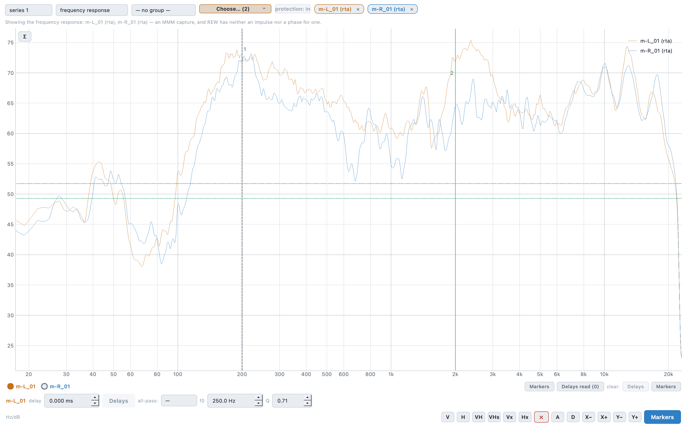

The curves come straight from REW. The row at the top:

- **series**: which capture series the curves are taken from.
- **frequency response / impulse / phase**: what to draw. An MMM capture has only a frequency
  response. REW has no impulse and no phase for one.
- **group**: fills the selection with a whole group from this car's glossary: the woofers, one side,
  everything.
- **Choose… (n)**: tick any measurements you want. Each one becomes a chip in its own colour; **×**
  takes it off.
- **protection: in / out**: *out* takes a protective filter back out of the curve before it is
  drawn; *in* shows the curve as measured.

**Σ** draws what the drivers do *together*: the complex sum of the curves on screen, dashed, with
each driver's delay applied.

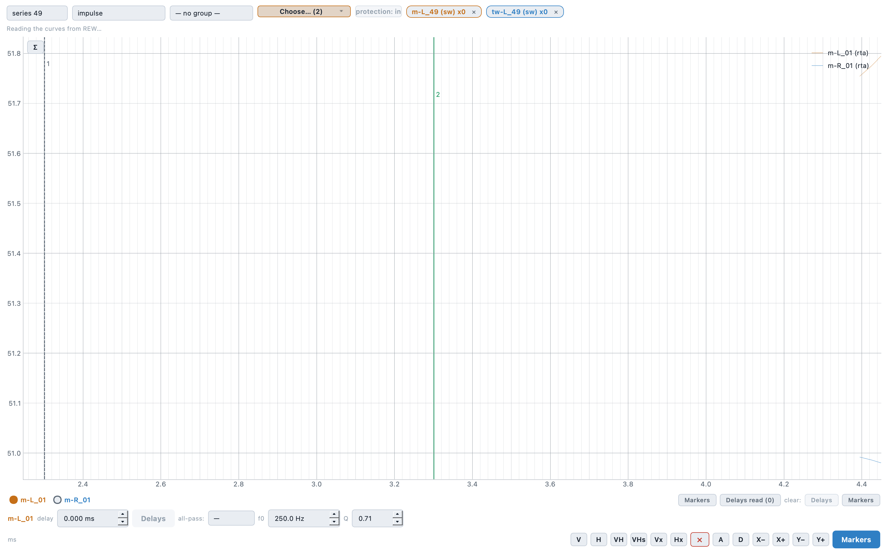

Below the plot:

- **delay**: holds the chosen driver back by this many ms. The radio buttons pick the driver.
- **all-pass, f0, Q**: an all-pass on the same driver. It changes no level, only the phase around f0.
  Put f0 at the crossover between the two drivers you are summing.
- **Markers** (V, H, VH, VHs, Vx, Hx, A, D): drag a marker onto the point you mean. The reading goes
  into the dialog's input box for you to edit and send. Nothing is sent without you.
- **Delays read (n)**: the delays read in this series, kept per series.

Nothing here reaches the processor. Try a delay or an all-pass on the measured curves first, then
enter it in the DSP and measure again.

The dark theme:

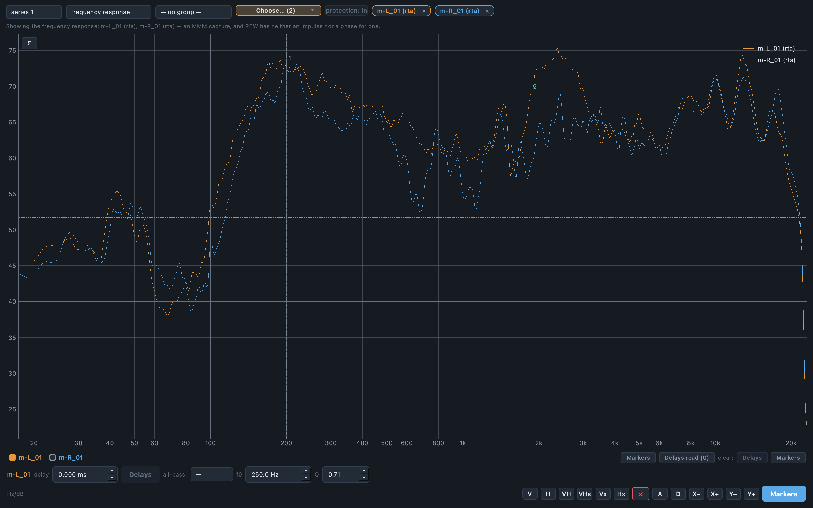

## Control mode

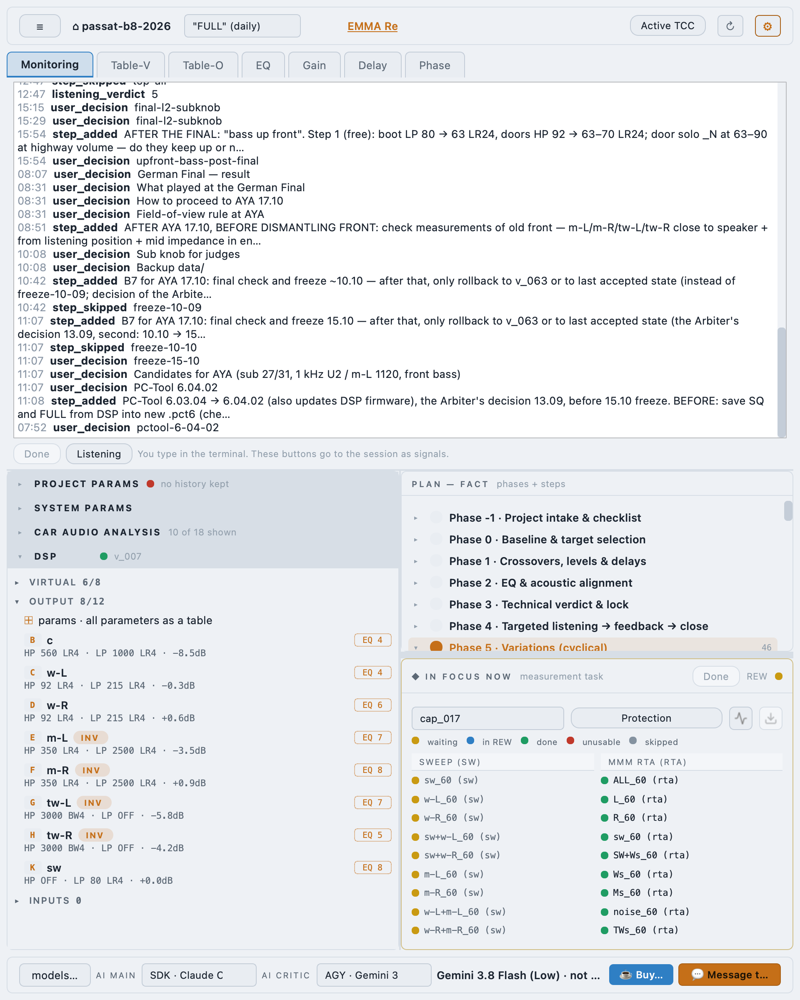

For a session that runs in a terminal. TCC moves to the right half of the screen, and the terminal
takes the rest. You type in the terminal, and TCC shows:

- **Monitoring**: the session's journal as it is written, newest at the bottom.
- **Table-V, Table-O, EQ, Gain, Delay, Phase**: the same views as the detail pane.
- The left column, the plan and the capture card, below.

**Done** and **Listening** reach the session as signals. **Active TCC** in the header brings the
full window back. Both borders can be dragged, and TCC remembers where you left them.

## The menu

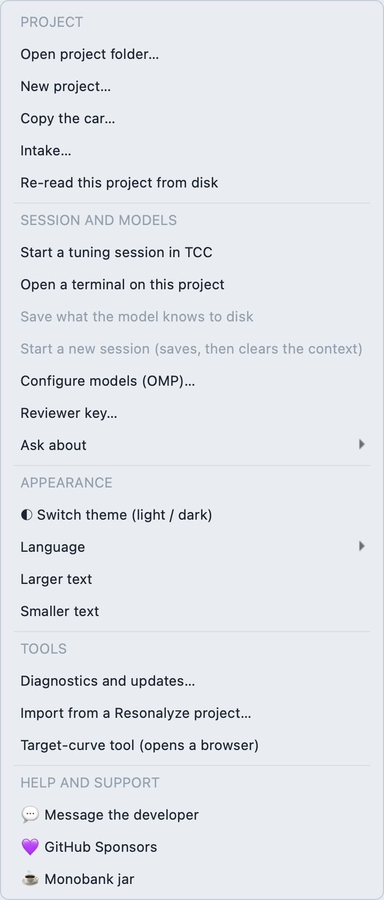

- **Project**: open another project folder, start a new one, copy a car from another project, run
  the intake form, re-read the project from disk.
- **Session and models**: start a session in TCC, open a terminal on the project, save what the
  model knows to disk, start a fresh session, configure models, set the reviewer's key, ask about
  something.
- **Appearance**: theme, language, text size.
- **Tools**: diagnostics and updates, importing from a Resonalyze project, the
  [target-curve tool](HOUSE-CURVE.md).
- **Help and support**: **📖 User guide** opens this guide on GitHub, at the version you have
  installed. Then message the developer, and the support links.

## Dialogs

### Models

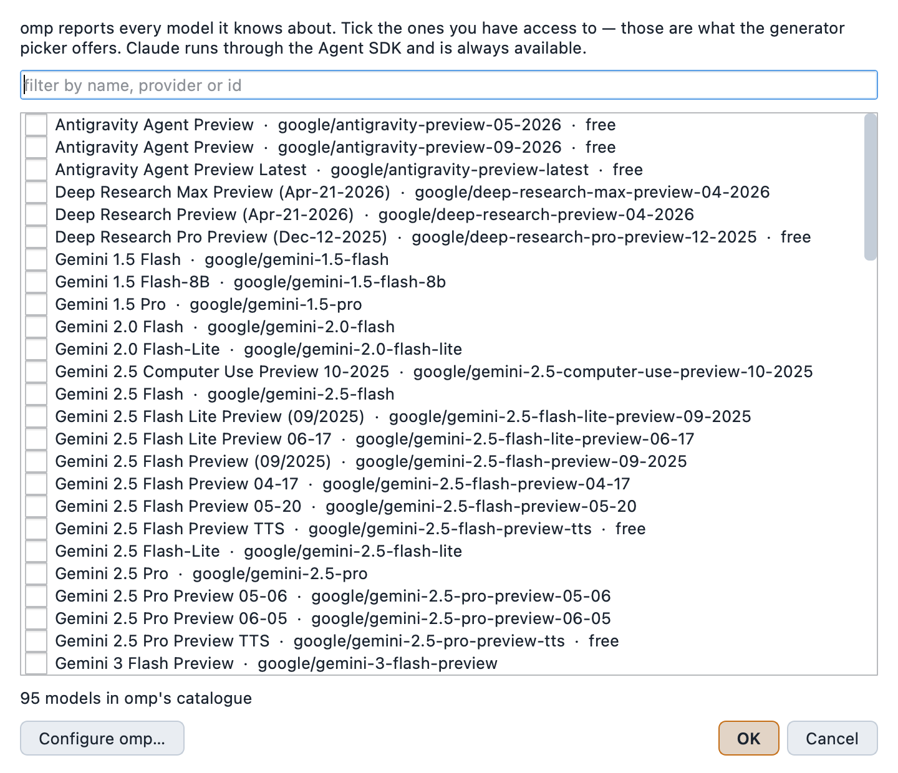

Which models this project may use. Tick the ones you have access to; those are what the *AI main*
picker offers. Claude runs through the Agent SDK and is always available. The other models run
through OMP, and **Configure omp…** sets OMP up.

### Listening notes

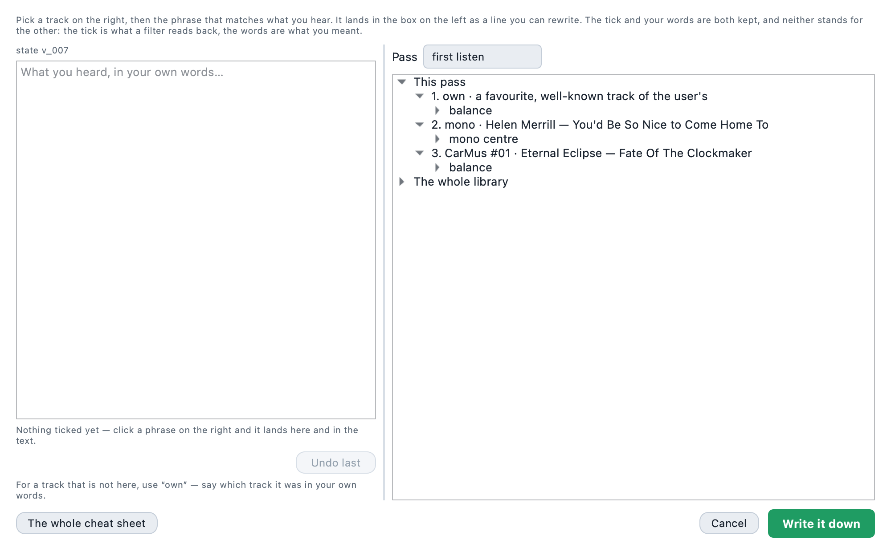

Opens in the listening phase. Pick a track on the right, then the phrase that matches what you
hear. It lands on the left as a line you can rewrite. Both are kept: the tick is what the method
reads back, and your words are what you meant. **The whole cheat sheet** shows every phrase.
**Write it down** records the pass.

### Protective filters

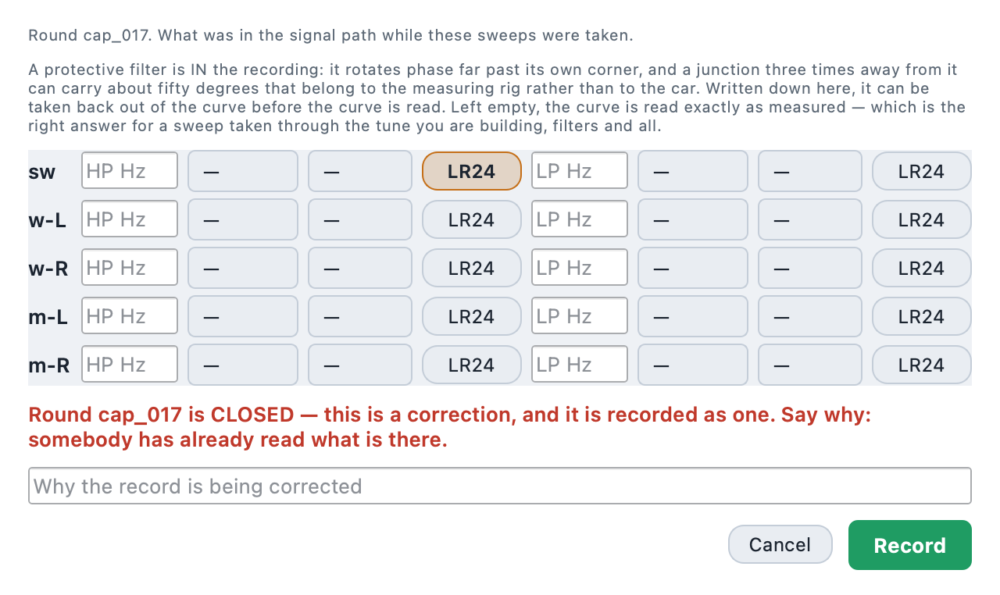

A protective filter in the signal path, such as a high-pass that keeps a tweeter safe during a raw
sweep, shifts the phase well past its own corner frequency. Record it here, and the analysis takes
it back out of the curve before reading it. Leave it empty, and the curve is read as measured, which
is right for a sweep taken through the tune you are building.

The screenshot shows a round that is already closed. A change to a closed round is recorded as a
correction, so the dialog asks why.

### New project

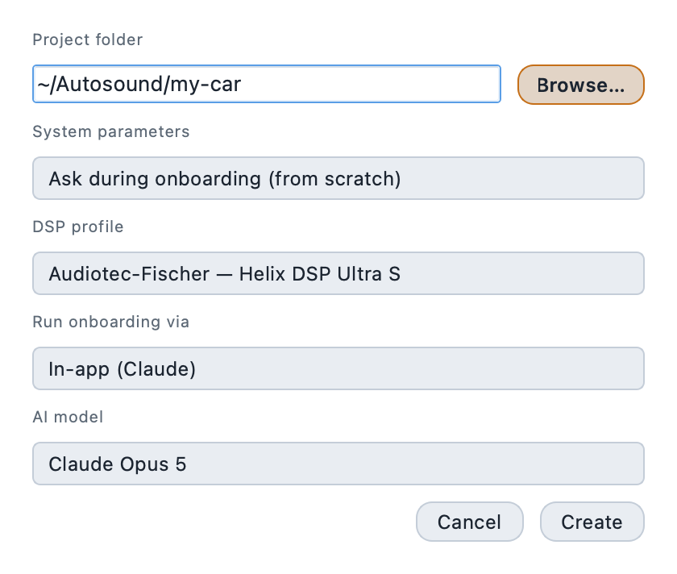

One folder per car. An empty folder is fine: the onboarding conversation fills it in. Pick the DSP
profile, who runs the onboarding (in TCC, or in a terminal), and the model. A new project can also
start from an existing one: the car, the drivers, the glossary and the DSP profile come over, and
you adjust them.

### Message the developer

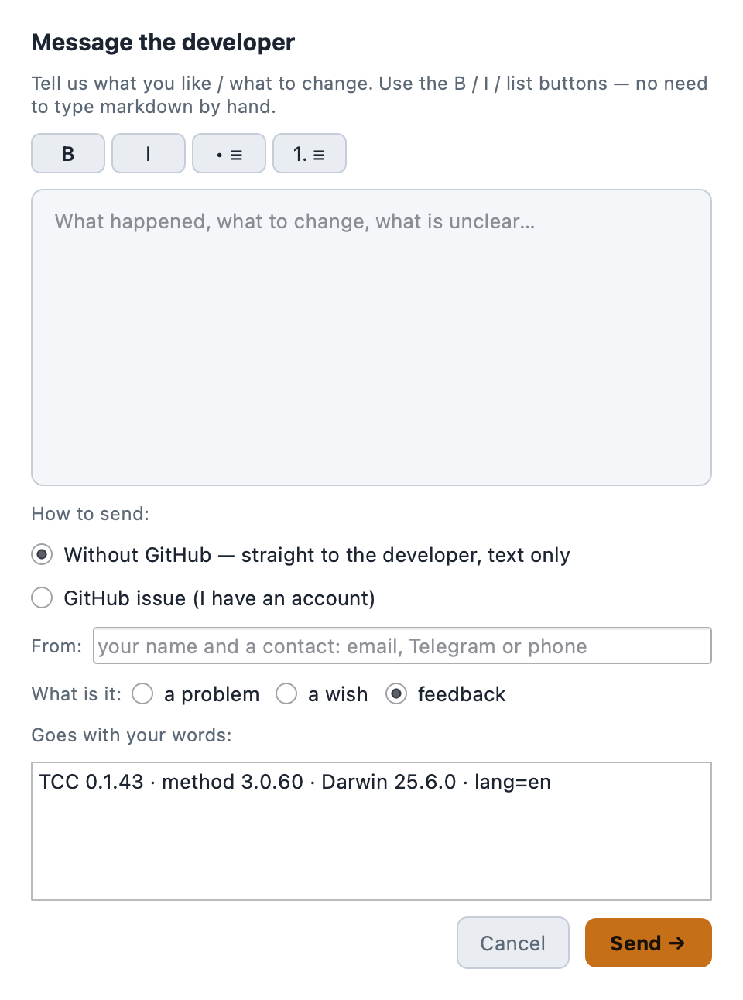

Write what happened or what to change, choose whether it goes straight to the developer or as a
GitHub issue, and send. The version line at the bottom goes with your message.

## The footer

At the bottom of the [main window](#the-window):

- **models…**: the same dialog as *Configure models* in the menu.
- **AI main** and **Effort**: the Generator and how hard it thinks. *x-high* is the default and
  suits almost every step.
- **AI critic**: the reviewer, and its status next to it.
- **Buy me a coffee** and **Message the developer**.
